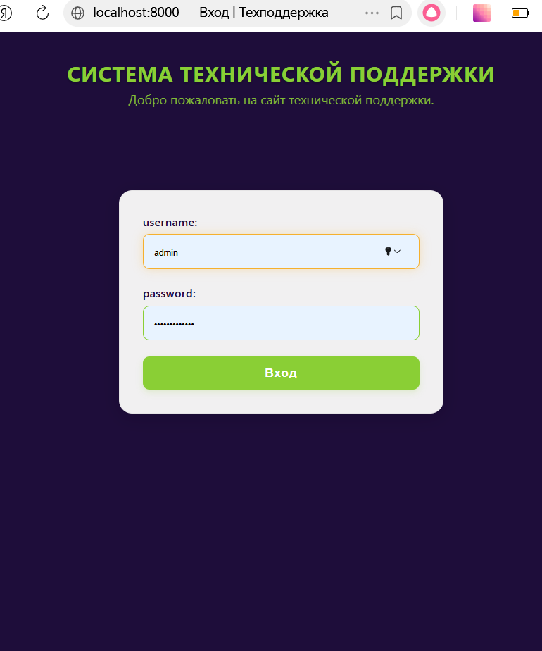
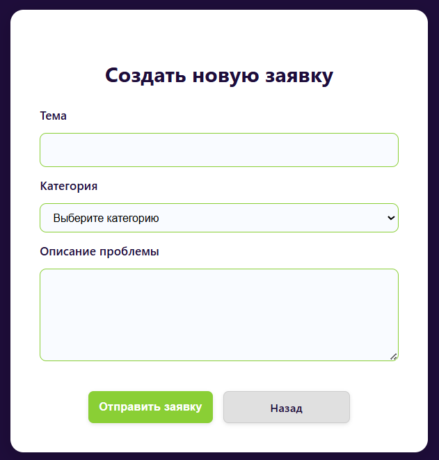
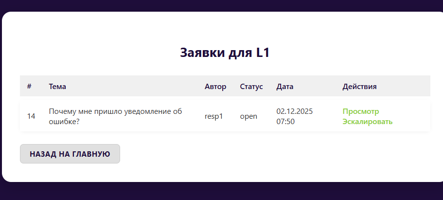
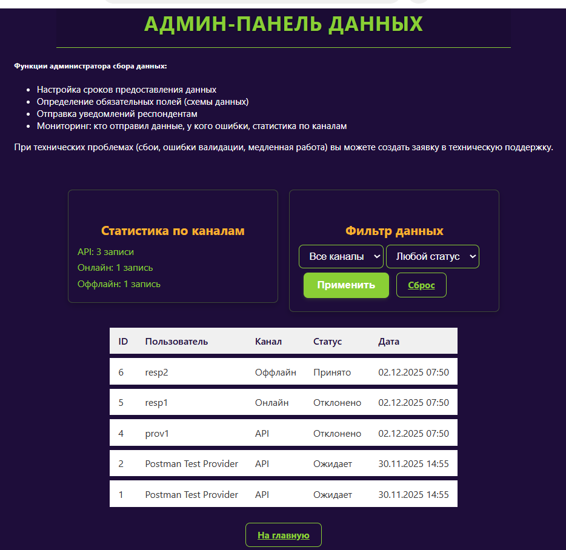

# Система технической поддержки для сбора и обработки данных (Кейс от КРОК)

##  Описание задания
Разработана система приёма данных от трёх типов пользователей через три канала, с трёхуровневой технической поддержкой:

- **Канал 1**: API (для поставщиков)
- **Канал 2**: онлайн-форма (для респондентов)
- **Канал 3**: оффлайн-файл (для респондентов)

Система обрабатывает 6 типов обращений в полном соответствии с кейсом, разделяя **бизнес-вопросы** (сроки, содержание) и **технические проблемы** (ошибки, сбои, производительность).

Полное задание можно посмотреть в файле Кейс.pdf

---

---

## 👥 Роли пользователей

### Респонденты
- **Обязанности**: предоставляют данные в срок через Канал 2 или 3.
- **Взаимодействие**:  
  - С **Администраторами** — по всем вопросам (сроки, состав данных)  
  - С **ТП** — **только если Система выдала ошибку** (автоматически создаётся заявка)

  ### Администраторы сбора данных
- **Обязанности**: настройка сроков, мониторинг данных, отправка уведомлений.
- **Взаимодействие**:  
  - С **респондентами** — по срокам и содержанию  
  - С **ТП** — по техническим проблемам Системы

### Поставщики сервиса передачи данных
- **Обязанности**: интеграция API, доставка данных и уведомлений.
- **Взаимодействие**:  
  - С **респондентами** — по UI и доставке  
  - С **Администраторами** — по срокам  
  - С **ТП** — только по вопросам API

---

## 🛠️ Трёхлинейная техподдержка

| Уровень | Роли | Функции |
|--------|------|--------|
| **L1** | Консультант, Ведущий консультант | Приём заявок, объяснение ошибок, эскалация в L2 |
| **L2** | Тестировщик, Разработчик, Аналитик | Решение технических проблем: API, валидация, баги |
| **L3** | Технический менеджер, Менеджер проекта | Управление процессами: SLA, производительность, оптимизация |

---

## Как запустить

### Требования
- Docker 20.10+
- Docker Compose 2.0+
- Git

### Инструкция
1. Клонируйте репозиторий
2. Запустите систему: 
```bash
    docker-compose up --build
```
3. Откройте в браузере: http://localhost:8000
4. Для демо-данных создайте суперпользователя: 
```bash
    docker-compose run --rm web python manage.py createsuperuser
    docker-compose run --rm web python manage.py create_demo_data
```

## Пример работы программы
#### Главная страница


#### Страница респондента


#### Форма по созданию заявки


#### Список заявок


#### Панель администратора


#### Уведомления 


## Стек технологий
Backend: Django + Django Rest Framework
Frontend: CSS + HTML
Database: PostgreSQL
Контейнеризация: Docker

